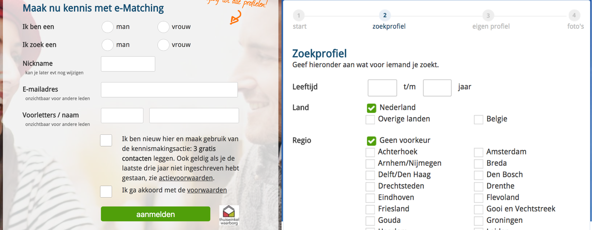

# Inspiratie selectievragen

## **Toelichting: Online dating platformen** 

De eerste stap in het zoeken naar geschikte dating platformen is kijken welke goed worden aangeschreven. Mijn voorkeur ligt bij platformen die hoog worden aangeschreven door gebruikers en betaald zijn \(dit is voor mij een indicatie dat er onderzoek is gedaan naar hun selectievragen\). De platformen die ik heb bekeken zijn zijn: [woongroep.net](http://woongroep.net), [relatieplanet.nl](http://relatieplanet.nl) en [e-match.online](http://e-match.online). In dit hoofdstuk ga ik per dating platform de sectievragen toelichten en beschrijven waarom deze wel of niet van waarde kunnen zijn voor mijn onderzoek.

## E-matching

De eerste dating site die ik heb bekeken is E-matching. Wat mij vooral is opgevallen is dat de vragen verdeel waren over de hele website. Ze filteren al meteen op de landingspage waar ze een verschil  maken tussen man of vrouw.  

Waar deze website mee helpt is het selecteren van standaard vragen. Hier had ik nog niet over nagedacht en zal ik zeker ook moeten opnemen in mijn vragen. Deze standaard vragen \(informatie\) betreft topics als: leeftijd, regio, opleidingsniveau et cetera. Ik ga hier dieper op in op de volgende pagina. 

**Lijst met standaard vragen**

Omdat ik hier nog niet over had nagedacht moet ik goed kijken naar welk soort vragen van toepassing zijn voor mijn project. Niet alle vragen op E-matching zijn van toepassing voor mijn gebruikers. 

| **Nr.** | **Lijst standaard vragen** | **Relevantie project** |
| --- | --- | --- | --- | --- | --- | --- | --- | --- | --- | --- |
| 1. | Ik ben een man/vrouw | Relevant |
| 2. | Ik zoek een man/vrouw | Relevant |
| 3. | Leeftijd | Relevant |
| 4. | Regio | Relevant |
| 5. | Opleidingsniveau | Misschien relevant |
| 6. | Kinderen | Relevant |
| 7. | kinderwens | Niet relevant |
| 8. | Roken | Relevant |
| 9. | Werkend | Relevant |
| 10. | Inkomen | Relevant |

**Conclusie**

Deze website heeft mij het inzicht gegeven dat ik met meer vragen rekening moet houden dan alleen de vragen om te matchen op persoonlijkheid. Ik heb een aantal vragen op deze website gevonden zoals aangegeven in de tabel die relevant zouden kunnen zijn voor mijn project. Vooral de volgende vragen weet ik zeker dat ik mee ga nemen naar mijn eigen vragenlijst. 

1. Ik ben een man/vrouw
2. Ik ben op zoek naar een man/vrouw
3. Leeftijd
4. Heb je kinderen
5. Rook je
6. Wat heb je te besteden \(budget\)

## **Woongroep.net \(geen dating platform\)**

**Algemene indruk Woongroep.net**

De website van [woongroep.net](http://woongroep.net) oogt verouderd. De website is niet mobile ready en het lijkt vrij chaotisch. Op deze site kunnen mensen op zoek gaan naar woongroepen. Het is een plek voor vraag en aanbod. Het valt me op dat ook op dit platform de vragen vrij beperkt zijn. Ze maken plaats voor advertenties waar men zichzelf kan voorstellen in de hoop op een woongroep en woongroepen op zoek naar een extra huisgenoot. De selectievragen op deze site zijn niet echt aanwezig het zijn meer beschrijvingen. 

De beschrijvingen van [woongroep.net](http://woongroep.net) beschrijf ik uitgebreider op de volgende pagina.    

**Biografie**

Wat E-matching als [woongroep.net](http://woongroep.net) met elkaar gemeen hebben is dat ze beiden ruimte overlaten voor de gebruiken om iets persoonlijks over zichzelf te vertellen als een soort korte biografie. Het kan zo zijn voor mijn project dat een match op basis van **gewoontes, gemeenschappelijke interesses en persoonlijkheid** niet genoeg is. Naar alle waarschijnlijkheid hebben gebruikers dit ook extra nodig om zich goed te profileren.  

**Lijst met beschrijvingen**

Hier volgt een lijst met beschrijvingen voor het profiel van een gebruiker of woongroep. 

| **Nr.** | **Lijst beschrijving** | **Relevantie project** |
| --- | --- | --- | --- | --- | --- | --- | --- | --- | --- | --- |
| 1. | Titel \(voor advertentie\) | Misschien relevant |
| 2. | Ik ben een man/vrouw | Relevant |
| 3. | Leeftijd | Relevant |
| 4. | Kinderen | Relevant |
| 5. | Provincie  | Relevant |
| 6. | Stad | Relevant |
| 7. | Wensen pand | Niet relevant |
| 8. | Wensen groep | Niet relevant |
| 9. | Beschrijf jezelf | Relevant |
| 10. | Reageer op bericht | Misschien relevant |

**Conclusie**

Over het algemeen zijn de beschrijvingen vrij generiek \(algemeen\). Bijna alle van deze topics zijn ook te vinden bij E-matching. Vooral de vraag die terug blijven komen zijn: ik ben man/vrouw, kinderen, provincie, stad, beschrijf jezelf. Over het algemeen ben ik niet veel wijzer geworden van deze website omdat deze specifiek gericht is naar mensen die op zoek zijn naar een woongroep en niet naar één ander als individu. In het concept valt er vrij weinig te matchen het is simpelweg een platform waar mensen zich kunnen voorstellen. 

Wat wel een belangrijk inzicht is geweest dat zowel op [woongroep.net](http://woongroep.net) als E-matching mensen in staat zijn om soort biografie van zichzelf achter te laten waarin ze zichzelf kunnen voorstellen en duidelijker kunnen beschrijven naar waar ze op zoek zijn. Meestal worden er bij de advertenties een soort van beschrijving weergegeven die aangeven waar het bericht ongeveer over gaan. Dit kan ik ook gebruiken voor de gebruikers om ten eerste een soort van beknopte beschrijving van jezelf te geven die voor anderen is te zien. Daarna een uitgebreide beschrijving die weerspiegelt wie je bent en waar je naar op zoek bent. 

## **Relatieplanet.nl**

**Algemene indruk Relatieplanet**

De eerste indruk die ik krijg van Relatieplanet is dat deze het professioneelst overkomt. De user interface ziet er vrij recent uit en de website is over het algemeen vrij overzichtelijk. Het spreekt voor zich dat dit een website is om een partner te vinden. Toen ik dieper ging kijken en een account had aangemaakt kreeg kwam ik na het inloggen meteen terecht op een pagina waar ik een account moest in/aanvullen. Ze doen dit in een overzichtelijk format waarop ze een vraag stellen en je in hetzelfde vak antwoord kan geven. Deze vragen kunnen wellicht bijdragen aan mijn selectievragen dus op de volgende bladzijde zal ik een selectie maken waarvan ik denk dat ze enige relevantie kunnen hebben voor mijn project en geef ik een reflectie erop. 

**Lijst met selectie vragen**

Relatieplanet heeft veel verschillende vragen die ik op zou kunnen nemen. Ik ga echter alleen de relevante meenemen in dit verslag. Net als bij de vorige websites heb ik plek voor 10 vragen gereserveerd die verder zal toelichten in de conclusie. 

| **Nr.** | **Lijst selectievragen** | **Relevantie project** |
| --- | --- | --- | --- | --- | --- | --- | --- | --- | --- | --- |
| 1. | Wat houdt mij dagelijks bezig | Gewoontes |
| 2. | Mijn perfecte vakantie is | Gemeens. interesses |
| 3. | Mijn hobby’s zijn | Gemeens. interesses |
| 4. | In het weekend ga ik | Gewoontes |
| 5. | Ik sta misschien open voor huisdieren, want | Gemeens. interesses |
| 6. | Welke sport\(en\) ik kijk en beoefen | Gemeens. interesses |
| 7. | Beroep | Persoonlijkheid |
| 8. | Opleidingsniveau | Persoonlijkheid |
| 9. | Ben je religieus | Gemeens. interesses |
| 10. | Heb je kinderen | Persoonlijkheid |

**Conclusie**

Relatieplanet heeft voor mij bevestigd dat er over het algemeen dezelfde dingen worden gevraagd op datingsites. Dus als ik andere/nieuwe inzichten zou willen hebben dan zal ik uit een ander vaatje moeten tappen. Wat tot dus ver blijft terugkomen zijn: wat iemands favoriete activiteit is, wat men van het weekend doet, of mensen sportief zijn ingesteld ja of nee en of ze kinderen hebben. 

Met het artikel, woongroep, relatieplanet en E-matching in het achterhoofd heb ik voor nu voldoende informatie om zelf aan de slag te gaan met een selectielijst en te kijken wat mijn doelgroep vind van de selectie. Ik zal zeker nog tegen zaken aanlopen en er zullen zeker nog onderwerpen veranderen maar het is tijd voor de volgende stap. 

