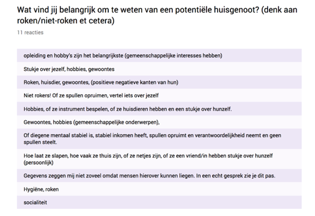

# topic selectievragen

## **Onderzoek naar topic selectievragen**

In het interview uit conceptualisatie zit een onderdeel waarin het in het volgende vraag. “Wat voor informatie zou je willen hebben van een potentiële huisgenoot? “ De antwoorden van deze vraag staat hieronder onder elkaar vermeldt. 

|   | **Sin-tin Fan** |
| --- | --- |
| 10. | Huisdieren, stabiel inkomen, hobbies, roken, gewoontes. |

|   | **Jeroen Bosch** |
| --- | --- |
| 10. | Hij zou graag de gewoontes willen weten van mensen. Jeroen is niet moeilijk en het maakt het hem niet veel uit verder. Zolang ze maar netjes zijn maar niet te netjes.  |

|   | **Amanda** |
| --- | --- |
| 10. | Ze gaf aan dat ze niet zo zeer geïnteresseerd is in per se hobby’s maar meer hoe diegene is om mee samen te wonen. Ze zou willen weten of ze sociaal zijn, of ze van taakverdeling houden, of ze verslaafd zijn, of ze verantwoordelijk zijn, of ze respectabel zijn en of ze genoeg geld verdienen om de huur te kunnen betalen met een stabiel inkomen.  |

**Conclusie**

Toen ik bij dit topic aan kwam viel het mij op dat de gebruikers allemaal probleem hadden om direct antwoord te geven op deze vraag. Ze moesten lang nadenken en wisten niet zeker of ze de antwoorden gaven die ik wou hebben. Aan de antwoorden is te zien dat mijn testpersonen over het algemeen veel generieke voorbeelden hebben gegeven. Voorbeelden die in dit interview terug kwamen zijn “roken, gewoontes en hoe huisgenoten zijn om mee samen te wonen”.  Belangrijke inzichten zijn dat de gebruikers gewoontes erg belangrijk vinden maar ook de persoonlijkheid van een potentieel huisgenoot.  

**Next steps**

In de volgende stap ga de resultaten laten zien van de enquete die in principe de zelfde vraag stelt. Het verschil met het interview is dat deze is ingevuld door meer mensen dus ik meer inspiratie van mijn doelgroep krijg. Wanneer ik de resultaten naar elkaar leg van het interview als de enquete hoop ik vergelijkbare resultaten te zien zodat ik een voetstuk heb voor het vervolg van het onderzoek. 

## **Survey over selectievragen**

Na mijn eerste interview heb ik een aantal inzichten gehad over wat de gebruiker belangrijk vond. Dat waren voornamelijk dat gewoontes erg belangrijk bleken en de persoonlijkheid van een individu. Tijdens deze survey stel ik de vraag nog eens maar deze keer bij mensen die ik niet persoonlijk ken. Het voordeel hiervan is dat ik misschien andere antwoorden krijg omdat de mensen die ik ken in dezelfde bubbel vallen \(hetzelfde soort mensen zijn\). Het zou zelfs perfect zijn als bepaalde waarde uit het interview terug komen omdat ik dan op basis van deze antwoorden verder kan gaan met mijn onderzoek. Een screenshot van het deel uit de survey staat hieronder weergegeven.   

**Conclusie**

Wanneer ik de resultaten van de survey ga vergelijken met het interview kan ik tot de conclusie komen dat de rode draad hetzelfde is. In de survey worden de antwoorden weliswaar op een andere manier gegeven maar dezelfde topics blijven terugkomen: gewoontes en persoonlijkheid. Er zijn echter aanvullingen die ik mee kan nemen in het onderzoek. Deze zijn: stukje over jezelf, gemeenschappelijke onderwerpen, socialiteit, gemeenschappelijke interesses en verantwoordelijkheid. 

 Ik moet een bodem leggen voor de selectievragen en deze ga ik baseren op de volgende input van de gebruikers: **gewoontes, gemeenschappelijke interesses en persoonlijkheid**. 

