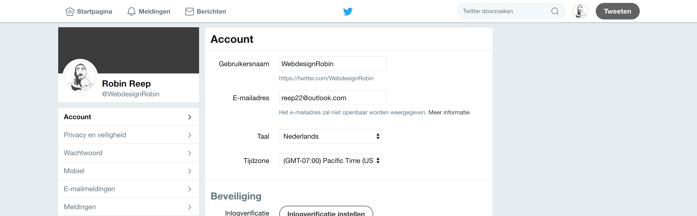
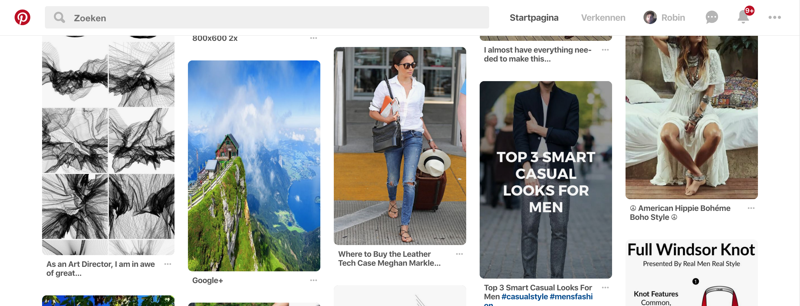
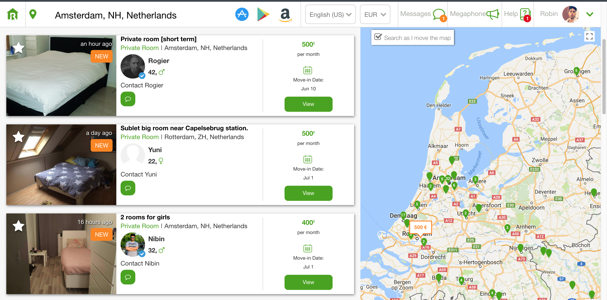
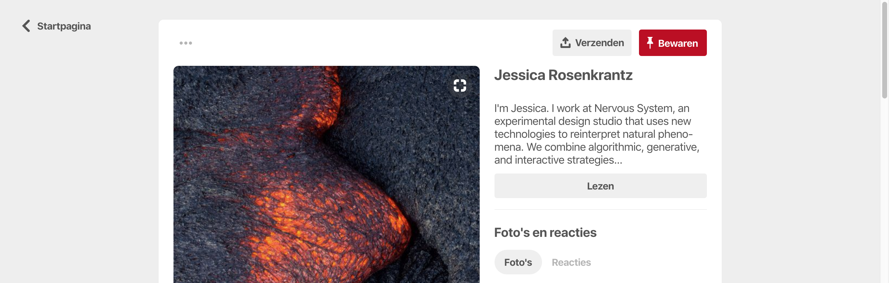

# Inspiratie

## Instellingen-pagina

#### Twitter

In mijn zoektocht naar inspiratie voor een instellingen-pagina ben ik bij [Twitter](https://twitter.com/settings/account) terecht gekomen. Het ontwerp van deze instellingen pagina spreekt mij persoonlijk aan. Dit komt dat er aan de rechterzijde een overzichtelijk en minimalistisch formulier staat. Aan de linkerzijde staat een een onderdeel van een profiel met een korte biografie en een basis informatie. Dit pas bij de informatie die ik ook moet verwerken op mijn website.

## Match scherm

#### Pinterest

In mijn zoektocht naar inspiratie voor het match-scherm ben ik bij [Pinterest ](https://www.pinterest.es/)terecht gekomen. Wat deze voornamelijk erg goed doen is het overzichtelijk plaatsen van thumbnails. De foto zegt genoeg en het geeft de gebruiker genoeg ruimte om te veel opties te bekijken.

#### Roomster

De de tweede kandidaat voor het match-scherm heb ik gevonden op Roomster. Ze bieden een vergelijkbare service als dat mijn platform. Deze laten zoekresultaten onder elkaar zien. Ik vind dit overzichtelijk omdat er  genoeg ruimte is om informatie kwijt te kunnen. Dit zou ik ook kunnen gebruiken voor mijn platform. Wanneer gebruikers aan het filteren zijn kunnen ze alvast informatie lezen over een potentiële match. 

## Detail scherm

#### Pinterest

Voor het detail scherm ben ik weer bij [Pinterest](https://www.pinterest.es/) terecht gekomen. Op het moment dat je je als gebruiker op een thumbnail klikt dan klapt deze open. Er wordt een foto laten zienaan de linkerzijde en detail informatie staat aan de rechterkant. Er staat een uitgebreide beschrijving aan de rechterzijde met een knop over meer lezen. 

