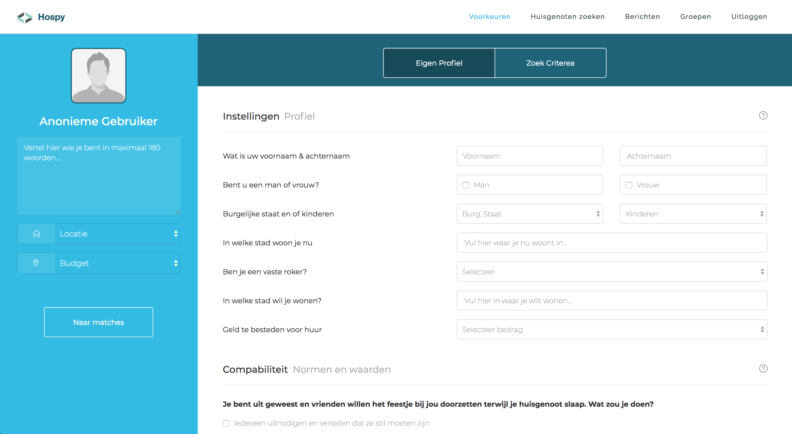
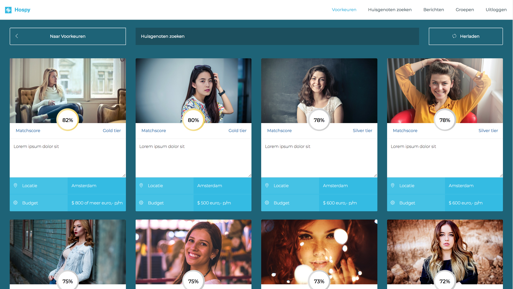
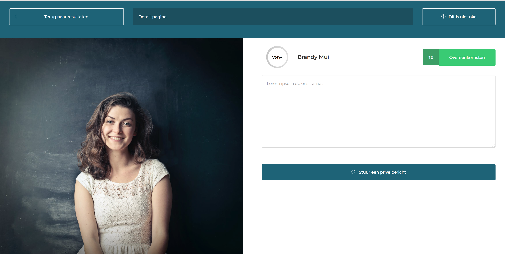

# nieuwe schermen

## Homepage

Aan de homepage heb ik tot dus ver niks veranderd. Hier kom ik later op terug. Ik wou eerst prioriteit geven aan andere features op de website. 

## Instellingen

#### Verwerken feedback

1. Het profiel aan de linkerzijde heb ik smaller gemaakt zodat er meer ruimte vrij is gekomen voor het formulier. 
2. De tabs aan de bovenkant om te kunnen filteren waren niet duidelijk genoeg. Nu heb ik deze in een blauwe balk geplaatst. Dit zorgt voor contrast en valt op deze manier meer op. ook heb ik de tekst erin veranderd zodat het voor minder verwarring zorgt. 
3. In tegenstelling tot het eerste prototype heb ik de goede selectievragen in het formulier toegepast. De gebruiker was ook in de war over het tweede segment van de pagina omdat het een invul form was die hij niet begreep. Deze heb ik vervangen door checkboxen en drop-downs. 
4. De navigatie heb ik op de pagina verbeterd. Er staat nu een knop in het profiel die de gebruiker direct stuurt naar de matches en de gebruiker kan ook in de bovenste navigatie naar 'huisgenoten zoeken'.

## Match scherm

#### Verwerken feedback

1. Ik heb de gebruiker zelf uit de resultaten gehaald en dit heeft plaats gemaakt voor een overzicht van meerdere gebruikers. 
2. Ik heb de tone of voice nu hetzelfde gehouden als de rest van de website. Ik heb de rode kleur verwijderd en alles in nu blauw-groen van kleur. 
3. Ik heb de gebruiker toegang gegeven tot meer zoekresultaten. In het vorige prototype waren er maar 6 matches te zien. In deze variant kan de gebruiker eindeloos naar beneden scrollen zolang deze matches heeft.
4. Ik heb de match-score belangrijk gemaakt in het concept. Ik heb deze verschillende kleuren gegeven die meteen aangeven hoe goed deze persoon bij je past als huisgenoot \(de tekst staat er ook bij vermeldt\).
5. De hele thumbnail is nu een link geworden. Als de gebruiker over een van deze heen navigeert dan wordt deze groter om aan te duiden dat het klikbaar is.

## Detail scherm

1. De gebruiker vond dat hij te weinig ruimte had voor het profiel en zou graag een breder overzicht willen zien. Ik heb nu van die pagina twee verschillende gemaakt. Ik heb de chat-pagina op een eigen pagina gezet. Dit detail overzicht bevat nu alle antwoorden. 
2. Ik heb het formulier dat de gebruiker invult bij instellingen gekopieerd en zo herkenbaar mogelijk onder deze pagina vermeldt. .

