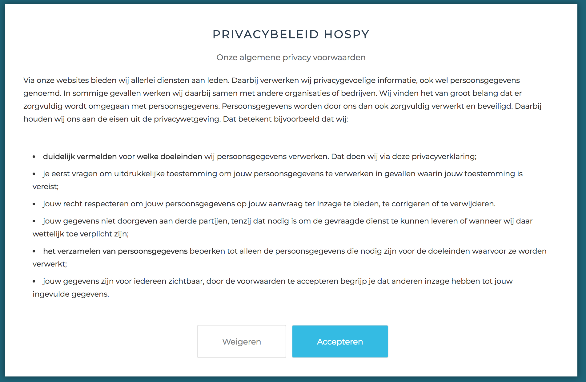
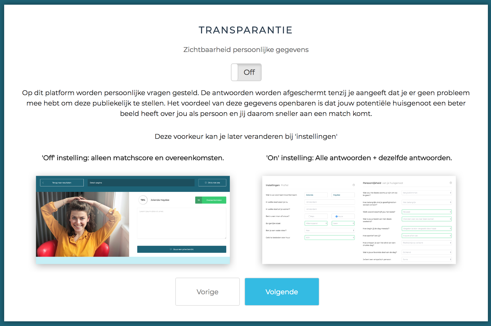
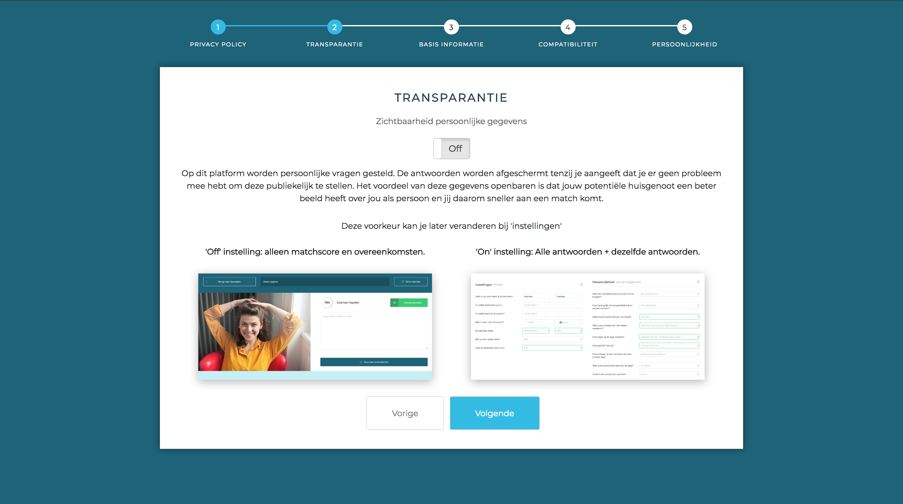
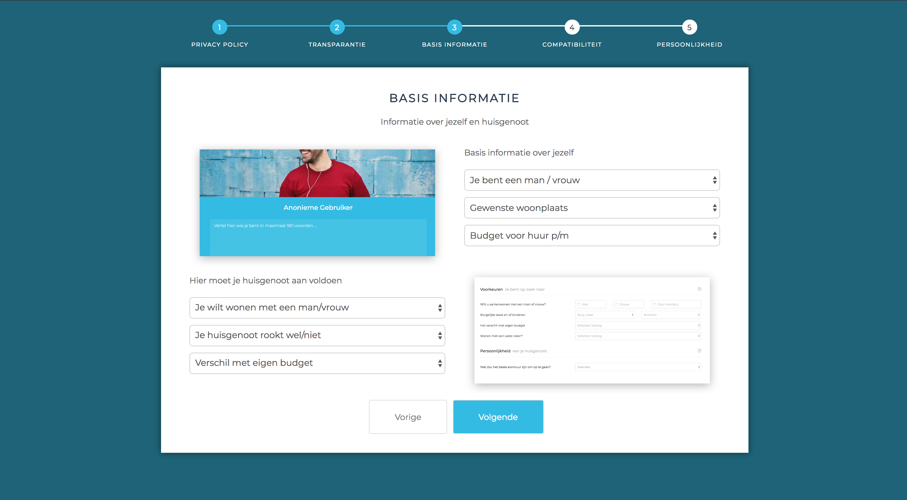
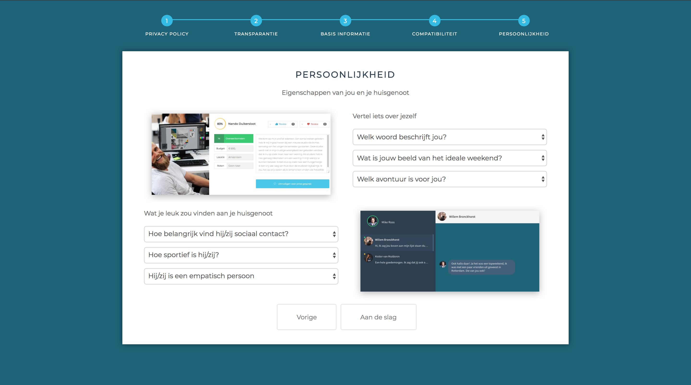

# wizard

## Wizard

Ik heb desk research gedaan naar een geschikte oplossing voor het probleem dat het formulier te veel is om in een keer in te vullen en de gebruiker het liefst in één keer wat resultaten wilt zien [usability tes](https://hospy.gitbook.io/product-biografie/ontwerpen/iteratie-2/usability-test)t. Ik ben uitgekomen op een artikel genaam '[Wizard Design Pattern](https://uxplanet.org/wizard-design-pattern-8c86e14f2a38)' \(Nick Babich april 2017\). Dit is een UX gerelateerd artikel die de positieve en negatieve kanten beschrijft van een form. 

## Voordelen

1. Een Wizard is handig om de gebruiker minder te laten denken.
2. Als een gebruiker taken moet verrichten die niet te versimpelen zijn kan een Wizard een uitkomst bieden. 
3. Een Wizard verlaagd de 'learning curve'. Het neemt de gebruiker bij de hand en laat deze zien wat de bedoeling is. 

## Nadelen

1. Een Wizard moet niet gebruikt worden wanneer de taak makkelijk te voltooien is.
2. Wanneer je iets extreem complex aan het uitleggen bent in de Wizard.

## Privacy

Mijn feedback van de Groenlicht presentatie was dat ik goed moest nadenken over de privacy van een gebruiker. Het is een actueel topic en mijn afstudeer begeleider had mij kenbaar gemaakt dat de persoonlijke informatie van de gebruiker zo op straat kan komen te liggen. 

Daarom heb ik ervoor gekozen om een privacy statement toe te voegen aan de Wizard die de gebruiker moet accepteren om verder te gaan. 

#### Toggle

Ook heb ik in de Wizard een extra scherm toegevoegd die gebruiker de optie geeft om zijn/haar gegevens openbaar te maken. Deze staat als default op uit. Dit heb ik gedaan zodat de gebruiker niet een vergissen maakt kan begaan. 

## De hele wizard

