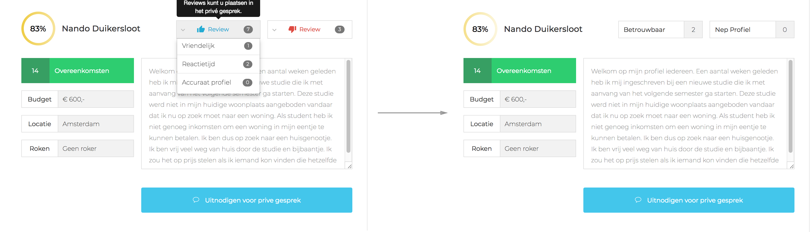
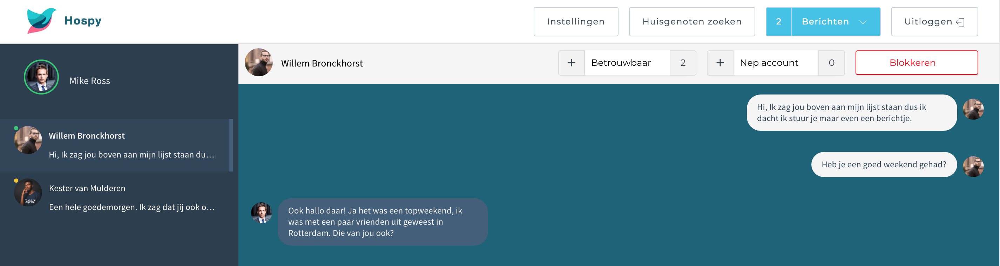
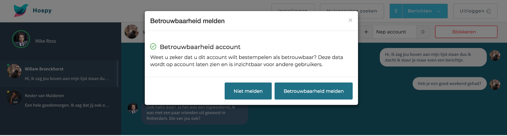
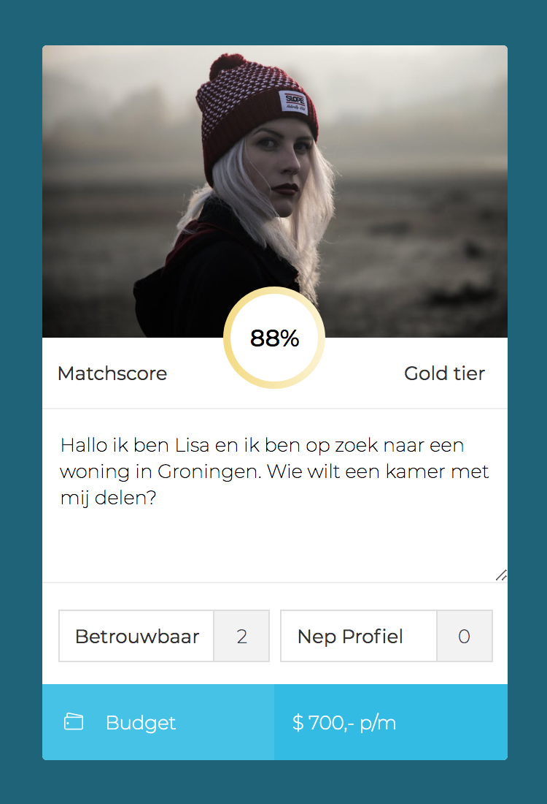

# usability test

## Video usability test: Juriaan Sombeek

{% embed data="{\"url\":\"https://youtu.be/HpPWhk0Wgq0\",\"type\":\"video\",\"title\":\"mov3\",\"icon\":{\"type\":\"icon\",\"url\":\"https://www.youtube.com/yts/img/favicon\_144-vfliLAfaB.png\",\"width\":144,\"height\":144,\"aspectRatio\":1},\"thumbnail\":{\"type\":\"thumbnail\",\"url\":\"https://i.ytimg.com/vi/HpPWhk0Wgq0/maxresdefault.jpg\",\"width\":1280,\"height\":720,\"aspectRatio\":0.5625},\"embed\":{\"type\":\"player\",\"url\":\"https://www.youtube.com/embed/HpPWhk0Wgq0?rel=0&showinfo=0\",\"html\":\"
<iframe src=\\\"https://www.youtube.com/embed/HpPWhk0Wgq0?rel=0&amp;showinfo=0\\\" style=\\\"border: 0; top: 0; left: 0; width: 100%; height: 100%; position: absolute;\\\" allowfullscreen scrolling=\\\"no\\\"></iframe>
\",\"aspectRatio\":1.7778}}" %}

## Belangrijke inzichten {#belangrijke-inzichten}

**Inzichten detail scherm**

1. Het was niet duidelijk voor Juriaan wat het verschil was tussen de verschillende opties waarop hij een positieve of negatieve rating achter kon laten.
2. Ik kon vanuit zijn reactie opmaken dat er te veel opties in stonden.
3. Hij gaf aan dat het fijn zou zijn als het simpeler kan.

## Verwerken feedback

De meerdere opties van de review feature waren verwarrend en moeste simpeler. Ik heb voor de oplossing besloten om terug te gaan naar de essentie. Het is een platform die veilig afspreken moet promoten. Daarom heb ik twee simpele keuzes overgelaten. Een positieve en negatieve review. De positieve verwoord ik als: betrouwbaar. De negatieve verwoord ik met: nep-profiel.

In dit scherm kan je geen review achterlaten. Dit kan alleen gebeuren op het moment dat beide gebruikers hebben ingestemd om af te spreken. In het volgende scherm laat ik zien hoe je zo een review plaatst. 

Uiteindelijk wanneer de reactie is geplaatst wordt deze in het match-scherm laten zien. Het hebben van een negatieve rating heeft geen invloed op de plaatsing in de **hiërarchie.** Ik kies ervoor om dit niet te doen omdat dit alle matches door elkaar zou gooien. Het ziet er als volgt uit in het match scherm. 

