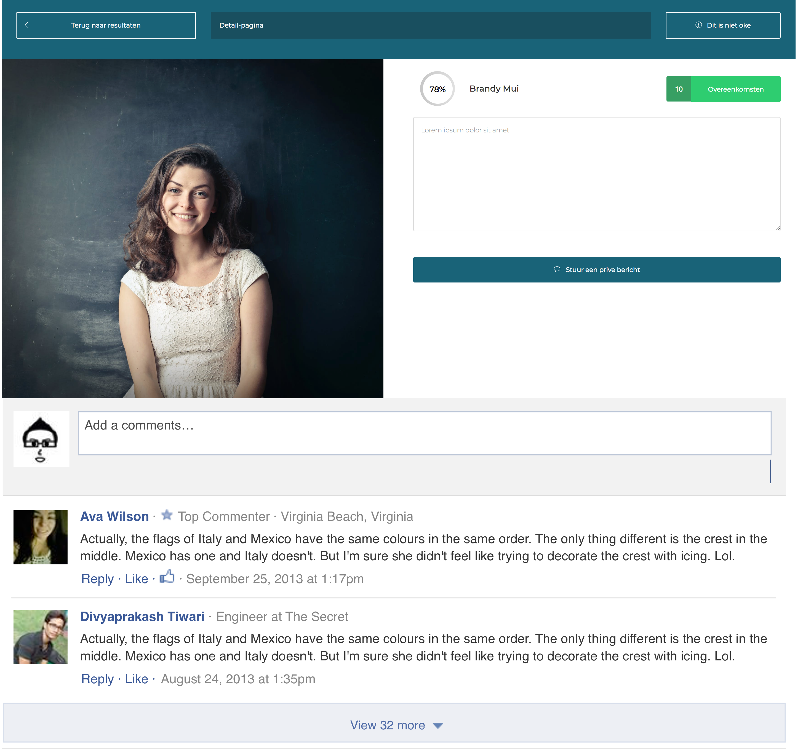
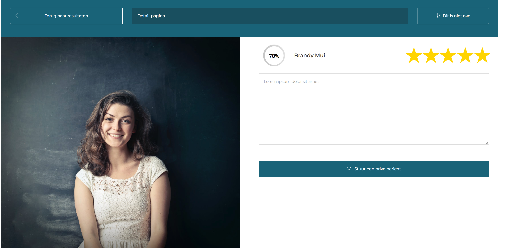
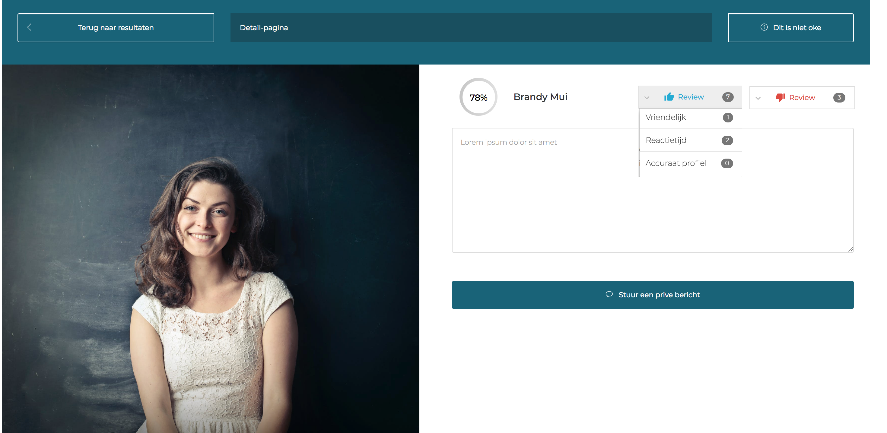

# veiligheid

## Verschillende toepassingen

Veiligheid is een belangrijk onderdeel van mijn project. mijn gebruikers gaan elkaar offline ontmoeten dus het is aan mij om de kwaliteit van deze ontmoeten te waarborgen. Ik heb naar verschillende manieren gekeken die aangeraden worden door artikelen over UX design. 

#### Comments

De eerste design pattern die ik heb gevonden die van waarde zou kunnen hebben voor de veiligheid op het platform is een 'comment' sectie. Dit pattern heb ik gevonden op [UI-patterns.com](http://ui-patterns.com/). Hier kunnen mensen berichten achter laten wanneer ze iemand hebben ontmoet en aangeven of dit persoon is wie hij/zij zegt dat die is. Ik heb het ontwerp van mijn detail scherm genomen en hier een illustratie van gemaakt. Deze wordt weergeven in de afbeelding hieronder. 

#### Star review

De tweede pattern die mijn platform zou kunnen helpen heb ik gevonden in een artikel van Edward Scott genaamd '[5 Requirements for the ‘Ratings Distribution Summary](https://baymard.com/blog/user-ratings-distribution-summary)’ on the Product Page, 2017'.

In dit artikel worden ratings in de vorm van sterren aangeboden. Dit zou ik kunnen gebruiken in mijn review systeem om aan te geven hoe goed het contact is met een andere gebruiker. Dit zou ook op het match-scherm kunnen worden laten zien. Ik heb dit toegepast in de detail pagina van mijn platform en staat hieronder aangegeven.

#### Thumbs up

De laatste design pattern heb ik gevonden op [www.appcues.com](https://www.appcues.com/blog/rating-system-ux-star-thumbs). Het artikel is geschreven door Julia Chen \(5-Star vs. Thumbs-Up: When to Use Which Rating System, 2017\). In dit artikel wordt er beschreven wanneer je een 'thumb up' of '5 stars rating' gebruikt. Dit artikel heeft mij geïnspireerd om een variatie te maken van het 'thumbs up' systeem. Deze uitwerken staat hieronder weergegeven. 

## Volgende stap

Om beter inzicht te krijgen in welke oplossing de beste is voor mijn platform ga ik in de volgende stap met een gebruiker zitten en stel ik haar/hem vragen over welke oplossing het dichtst in de buurt komt  en waarom. 

