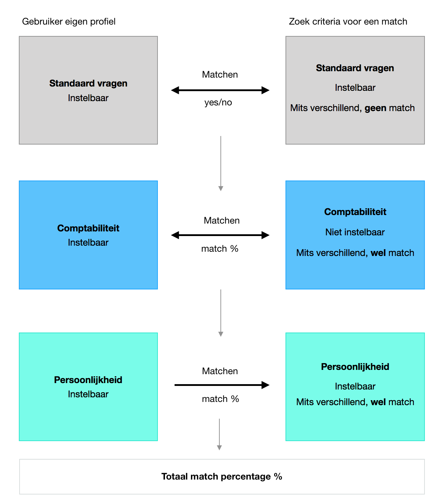

# Matching Algoritme

## Het matchen van gebruikers

**Matchen van gebruikers**

Zoals ik in hoofdstuk twee heb aangegeven gaat het algoritme matchen op twee verschillende soorten inputs. Een daarvan zijn de vragen over persoonlijkheid en de ander over comptabiliteit. Je kan deze twee los van elkaar zien omdat de gebruiker niet kan filteren op comptabiliteit vragen.

