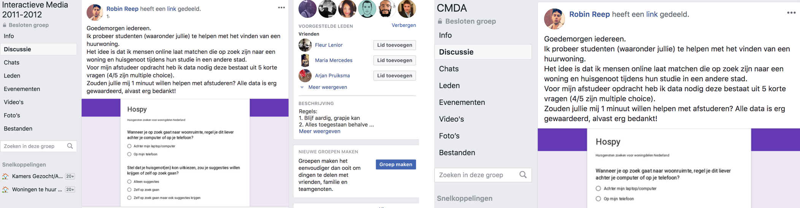
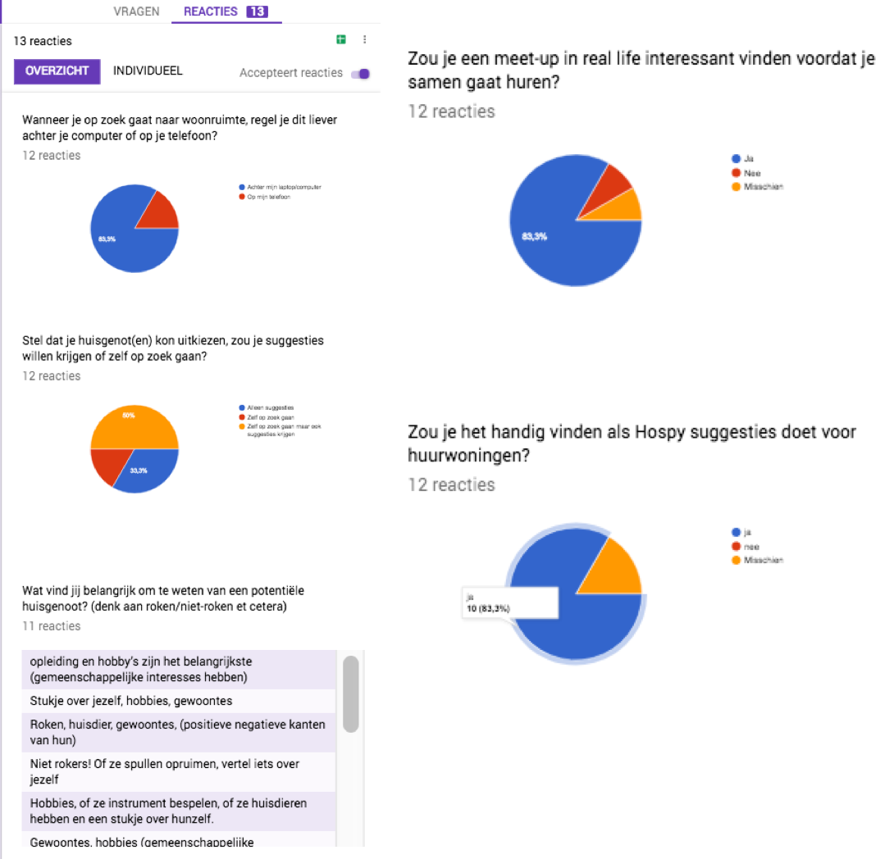
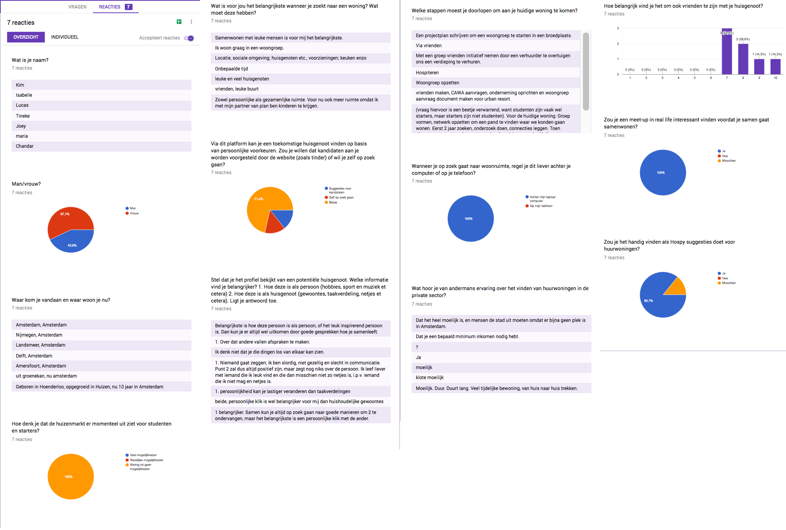
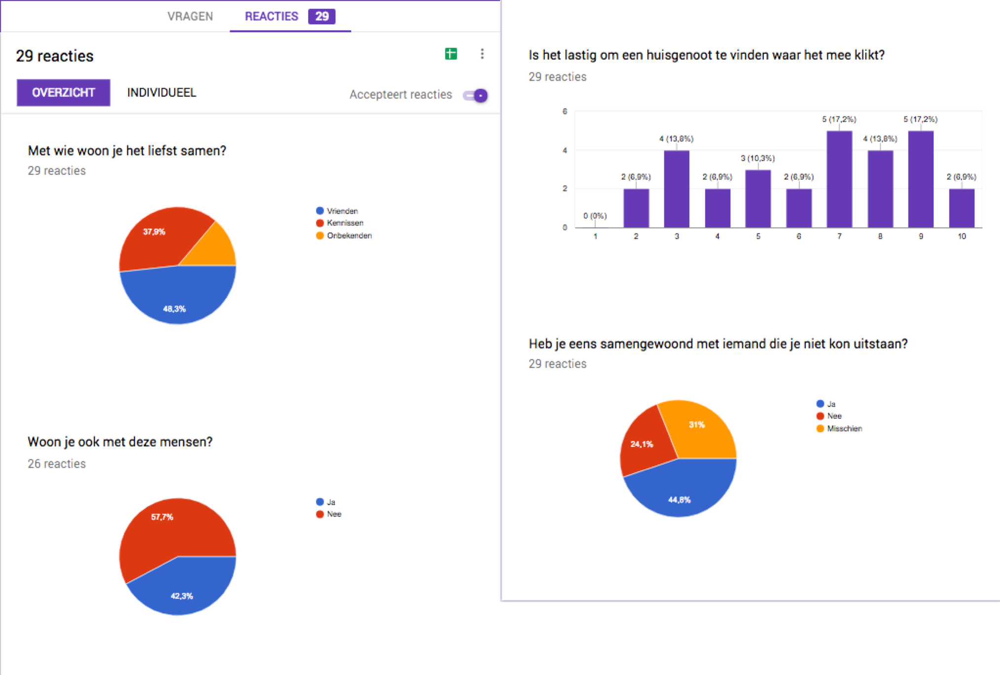

# enquete doelgroep

## **Enquete 1**

De eerste enquete heb ik opgesteld met de volgende hoofd en deelvragen in het achterhoofd. 

| Voor welk medium moet dit platform ontwikkeld worden. |
| --- | --- | --- | --- | --- |
| Willen gebruikers matches voorgesteld krijgen \(zoals Tinder\) of zelf zoeken? |
| Hoe wilt men met elkaar communiceren? \(Live-chat, voice-only, privé berichten, posts\)? |
| Is er behoefte voor een offline meetup? |
| Vinden studenten het wel belangrijk dat ze het kunnen vinden met hun huisgenoot? |

#### De enquetevragen

| 1.  | Wanneer je op zoek gaat naar woonruimte, regel je dit liever achter je computer of op je telefoon? |
| --- | --- | --- | --- | --- |
| 2. | Stel dat je huisgenot\(en\) kon uitkiezen, zou je deze voorgesteld willen krijgen of zelf op zoek gaan?  |
| 3. | Wat vind jij belangrijk om te weten van een potentiële huisgenoot? |
| 4. | Zou je een meet-up in real life interessant vinden voordat je samen gaat huren? |
| 5. | Zou je het handig vinden als Hospy ook suggesties doet voor huurwoningen? |

#### Gedeeld op Facebook.

De enquete heb ik gedeeld via Facebook omdat ik kwantitatieve data nodig heb. Op deze manier probeer ik veel mensen te bereiken. De Facebook groepen waar ik de enquete heb gedeeld zijn: 'Interactieve Media' en 'CMDA'.

#### Resultaten

De enquete heb ik gemaakt met 'Google formulieren' en de antwoorden op de vragen staan in de afbeeldingen hieronder weergegeven. 

#### Inzichten

1. De gebruiker gaat liever op zoek naar huisgenoten achter een computer i.p.v. telefoon. 
2. De gebruiker wilt matches krijgen voorgesteld door het systeem maar ook de mogelijk hebben om zelf op zoek te gaan. 
3. Wat de gebruiker belangrijk vind om te weten over een potentiële huisgenoot is te algemeen. De antwoorden komen vooral terug op gewoontes. 
4. Gebruikers vinden het belangrijk om elkaar te ontmoeten nadat een eventuele match heeft plaatsgevonden.  

## **Enquete 2**

De tweede enquete heb ik opgesteld omdat ik de eerste had laten zien aan mijn afstudeerbegeleider en hij vond bepaalde vragen niet goed genoeg. Nu daarna heb een nieuwe lijst met vragen gemaakt voor een enquête en gevraagd of hij deze zou willen delen binnen zijn woongroep. 

| 1.  | Wat is je naam? |
| --- | --- | --- | --- | --- | --- | --- | --- | --- | --- |
| 2. | Man/vrouw? |
| 3. | Waar kom je vandaan en waar woon je nu? |
| 4. | Hoe denk je dat de huizenmarkt er momenteel uitziet voor studenten en starters? |
| 5. | Welke stappen moest je doorlopen om aan je huidige woning te komen? |
| 6. | Wanneer je op zoek gaat naar woonruimte, regel je dit liever achter je computer of op je telefoon? |
| 7. | Wat hoor je van andermans ervaring over het vinden van huurwoningen in de private sector? |
| 8. | Wat is voor jou het belangrijkste wanneer je zoekt naar een woning? wat moet deze hebben? |
| 9. | Via dit platform kan je een toekomstige huisgenoot vinden op basis van persoonlijke voorkeuren. Zou je willen dat kandidaten aan je worden voorgesteld door de website \(zoals tinder\) of wil je zelf op zoek gaan? |
| 10. | Stel dat je het profiel bekijkt van een potentiële huisgenoot. Welke informatie vind je belangrijker? 1. Hoe deze is als persoon\(hobby’s, sport en muziek et cetera\). 2. Hoe deze  is als huisgenoot\(gewoontes, taakverdeling en netheid et cetera\). Ligt e antwoord toe.  |

#### Resultaten

De enquete heb ik gemaakt met 'Google formulieren' en de antwoorden op de vragen staan in de afbeeldingen hieronder weergegeven. 

#### Inzichten

1. Het algemene beeld is dat het moeilijk is om aan een woning te komen als student.
2. 71% geeft aan dat ze net als op Tinder, matches voorgesteld willen krijgen. Ze willen echter ook de mogelijkheid hebben om zelf nog te zoeken. 
3. De gebruikers geven aan dat ze de persoonlijkheid net zo belangrijk vinden als bijvoorbeeld gewoontes en huishoudelijk afspraken.
4. Gaat het liefst op zoek naar huisgenoten achter de computer. 
5. De gebruiker vind het ook belangrijk om vrienden te zijn met hun huisgenoot. 

## **Enquete 3**

Deze enquete heb ik opgesteld om de volgende probleemstelling te valideren: 'Het probleem is dat woningzoekende studenten in heel Nederland moeite hebben een geschikte huisgenoot te vinden waar ze het mee kunnen vinden. Vaak komen studenten terecht in woongroepen of studenten appartementen en hebben hun huisgenoten niet kunnen uitkiezen. Dit kan leiden tot onwenselijke situaties.'

| 1.  | Met wie woon je het liefst samen? |
| --- | --- | --- | --- |
| 2. | Woon je ook met deze mensen? |
| 3. | Is het lastig om een huisgenoot te vinden waarmee het klikt? |
| 4. | Heb je eens samengewoond met iemand die je niet kon uitstaan? |

#### Gedeeld op Facebook.

De enquete heb ik gedeeld via Facebook omdat ik kwantitatieve data nodig heb. Op deze manier probeer ik veel mensen te bereiken. De Facebook groepen waar ik de enquete heb gedeeld zijn: 'Kamer gezocht/Aangeboden in Amsterdam'.

#### Inzichten

1. Het overgrootte deel \(50%\) geeft aan dat ze met vrienden samen willen wonen. 
2. Meer dan de helft 60% geeft aan dat ze niet met deze mensen samen wonen. 
3. De meningen leken hier iets meer verdeelt maar de de meeste mensen hebben positief gestemd wat dus inhoud dat het moeilijk is om iemand te vinden waarmee het klikt. 
4. Veel mensen leken wel eens met een individu te hebben samengewoond die ze totaal niet mochten. 

