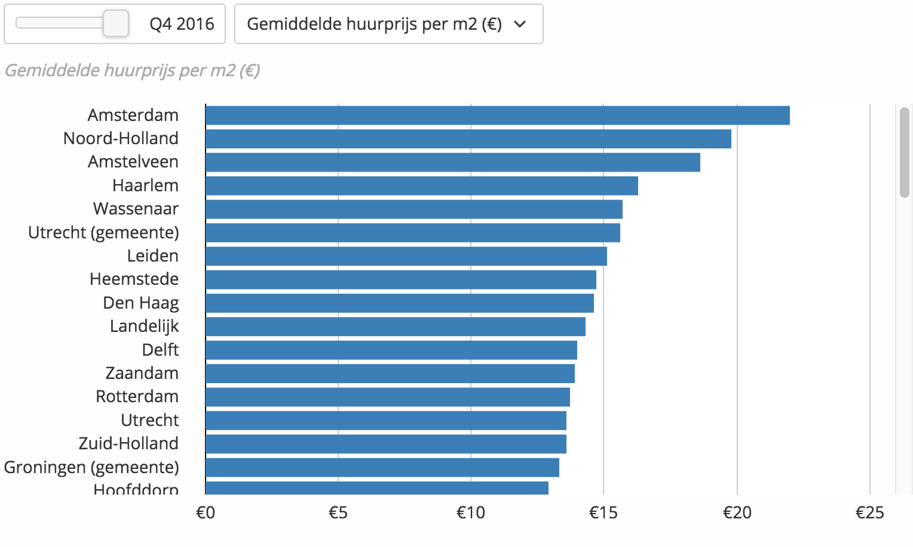

# huurprijzen in NL

## **Spreadsheet huurprijzen**

Dit is de tweede stap in het valideren of het mogelijk is voor een huishouden van twee studenten om een huis te bekostigen in de private sector. De huurprijzen per vierkante meter van de belangrijkste studenten steden zijn nodig om deze berekening te maken.

De statistieken voor de huurprijzen heb ik kunnen vinden op  de website van Indebuurt, 2016. In de afbeelding hieronder staan de staan alle steden in Nederland weergegeven. Ik heb alleen de 12 populairste studentensteden meegenomen omdat alleen deze van toepassing zijn voor mijn concept.  

#### Spreadsheet

Om de data van van huurprijzen overzichtelijk in een overzicht te krijgen heb ik in de onderstaande tabel een de steden uiteen gezet. De twaalf populairste studentensteden komen aan bod en de huur prijs per vierkante meter staat erbij vermeldt.  

| Stad | Grondprijs m2 |
| --- | --- | --- | --- | --- | --- | --- | --- | --- | --- | --- | --- | --- |
| Amsterdam | € 22 |
| Delft | € 14 |
| Den Haag | € 14,6 |
| Eindhoven | € 12,6 |
| Enschede  | € 9,3 |
| Leiden  | € 15,1 |
| Groningen | € 12,6 |
| Maastricht | € 12,5 |
| Nijmegen | € 10,7 |
| Rotterdam | € 13,7 |
| Tilburg | € 9,4 |
| Utrecht  | € 13,6 |

## Inkomsten student

Volgens een onderzoek van Nibud in 2017 genereerde een uitwonende student gemiddeld € 1.116,- aan inkomsten. Ik ga ervan uit dat het verschil tussen 2017 en 2018 niet dusdanig groot is dat het een rol speelt voor mijn onderzoek. 

In 2017 bleef 56% van de eerste tweedejaars studenten thuis wonen. Deze kregen van de overheid geen subsidie en gemiddelde inkomsten lagen rond de € 919,- euro.  Meer dan de helft van de studenten gebruikt de studentenlening om te sparen en houden dit op de bank. 

#### Extra informatie.

* 58% van de studenten ontvangen onregelmatig geld van hun ouders. Dit is gemiddeld € 165 euro per maand. 
* 94% van de studenten ontvangt studiefinanciering. Dit is gemiddeld € 559 euro per maand. 
* 70% heeft een bijbaan.
* Gemiddeld geeft een uitwonende student € 867 euro per maand uit.  

